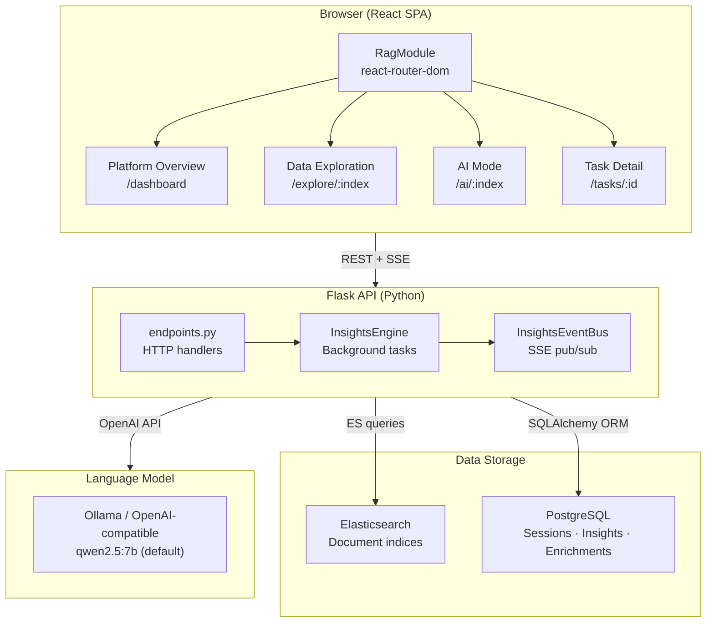
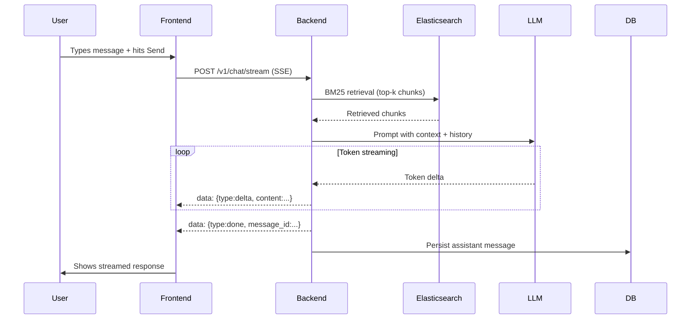
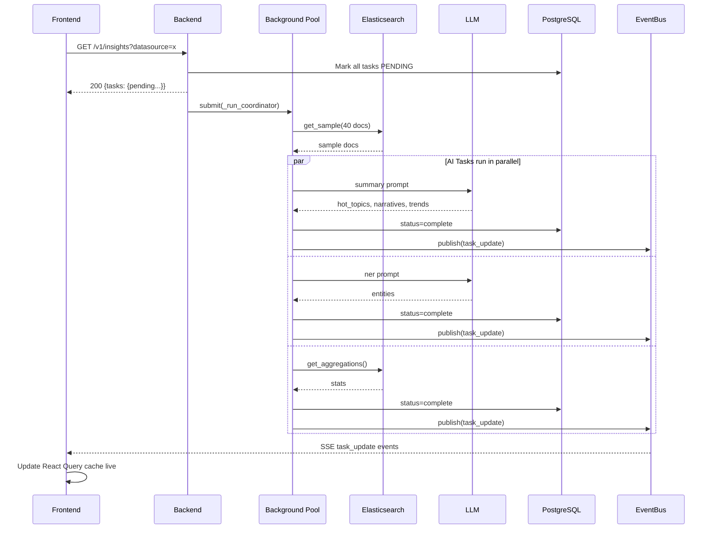
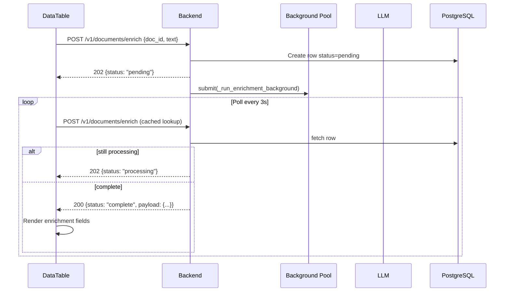
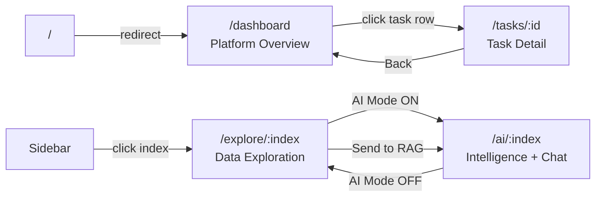

# QSINT RAG — Intelligence Platform

A **Retrieval-Augmented Generation (RAG)** platform for OSINT/intelligence analysis.  
Combines Elasticsearch document storage, an LLM (Ollama/OpenAI-compatible), and a React UI
to let analysts explore data, generate intelligence reports, and chat with documents.

---

## Table of Contents

1. [Architecture](#architecture)
2. [Features](#features)
3. [Tech Stack](#tech-stack)
4. [Getting Started](#getting-started)
5. [Configuration (.env)](#configuration)
6. [API Reference](#api-reference)
7. [Sequence Diagrams](#sequence-diagrams)
8. [Frontend Routes](#frontend-routes)
9. [Backend Components](#backend-components)
10. [Frontend Components](#frontend-components)
11. [Development](#development)

---

## Architecture



---

## Features

### Data Exploration (/explore/:index)
- Tabular view of all Elasticsearch documents with pagination (up to 1000/page)
- Advanced search: Elasticsearch query syntax (`title:"hack" AND sentiment:hostile`)
- Split-panel document view: click any row → right panel shows full content + AI enrichment
- Row selection + "Send N to RAG" for batch analysis
- Per-document AI Enrichment (cached in Postgres):
  - Summary (1-2 sentences)
  - Sentiment (positive / negative / neutral / hostile) — with coloured background on text
  - Classification (Cyber Threat, Geopolitics, Financial Crime, ...)
  - Named Entity Recognition (person, org, location, tool) — highlighted inline in text
  - Individual field reload buttons (reload just sentiment, just NER, etc.)

### Intelligence Report (/ai/:index)
- Non-blocking: HTTP returns immediately; background tasks update via SSE
- Corpus Statistics (static, from Elasticsearch aggregations):
  - Total doc count, top platforms, top regions, top entities
  - Topic word cloud
- Hot Topics (AI-generated): sentiment-coloured bubble chart + tag cloud
- Active Narratives (AI-generated): titled narrative descriptions with evidence doc IDs
- Trending Signals (AI-generated): direction + % change indicators + area chart
- Named Entities NER (AI-generated): bar chart + word cloud
- Relationship Network (AI-generated): interactive D3 force-directed graph
  - Drag nodes, scroll to zoom, arrow markers, type-colour legend
- Send to RAG: compose intelligence context and send to chat in one click

### RAG Chat (/ai/:index → RAG Chat tab)
- SSE streaming responses (tokens appear as they're generated)
- Session management (create, rename, delete, switch)
- Conversation history (configurable window via HISTORY_TURNS)
- Source citations with relevance scores [doc:ID]
- Leave and come back — responses are persisted in Postgres

### Platform Overview (/dashboard)
- All insight tasks + enrichment tasks in one place
- Status badges: Pending / Processing (animated spinner) / Complete / Error
- Per-task actions: Restart (re-trigger) and Clear (delete record)
- Overall task completion progress bar
- Auto-refreshes every 10s
- Click any task row to navigate to /tasks/:id detail page

### Task Detail (/tasks/:id)
- Full task metadata: datasource, type, status, timestamps (local + UTC tooltip)
- Structured payload viewer (summary, sentiment, classification, entities)
- Raw JSON payload collapsible section
- Restart / Clear actions

### URL-based Navigation
All pages have proper URLs that survive browser refresh:

| URL | Page |
|-----|------|
| / | redirect to /dashboard |
| /dashboard | Platform Overview |
| /tasks/:id | Task Detail |
| /explore/:index | Data Exploration (data mode) |
| /ai/:index | AI Mode (Intelligence Report + Chat) |

---

## Tech Stack

| Layer | Technology |
|-------|-----------|
| Frontend | React 18, TypeScript, Ant Design 5, react-router-dom 7, TanStack Query, D3.js, dayjs |
| Backend | Python 3.12, Flask (via QF Framework), SQLAlchemy, gevent |
| Database | PostgreSQL 15 |
| Search | Elasticsearch 8 |
| LLM | Ollama (local) or any OpenAI-compatible endpoint |
| Streaming | Server-Sent Events (SSE) for chat + insights |
| Tracing | OpenTelemetry + Jaeger (optional) |
| Containers | Docker Compose |

---

## Getting Started

### Prerequisites

- Docker + Docker Compose
- Node.js 20+ (for frontend development)
- Python 3.12+ (for backend development)
- Ollama with qwen2.5:7b pulled (or any OpenAI-compatible LLM)

### Quick Start

```bash
# 1. Clone and enter the repo
git clone <repo-url> && cd rag-poc

# 2. Copy environment config
cp .env.example .env   # edit as needed

# 3. Start infrastructure
docker-compose up -d   # Elasticsearch + PostgreSQL

# 4. Seed sample data
.venv/bin/python scripts/seed_elasticsearch.py

# 5. Start backend
.venv/bin/python main.py

# 6. Start frontend (dev server)
cd frontend && npm install && npm run dev
```

Open http://localhost:5173

---

## Configuration

All variables live in `.env` (loaded by python-dotenv):

```env
# API
API_PORT=5100
DEV_MODE=true
LOG_LEVEL=DEBUG

# PostgreSQL
DATABASE_URL=postgresql://qf:qf@localhost:5432/qsint_rag

# Elasticsearch
ES_HOST=http://localhost:9200
ES_INDEX=qsint_docs
ES_USER=
ES_PASSWORD=

# Datasource type: "es" or "file"
DATASOURCE_TYPE=es
FILE_DATASOURCE_PATH=./data/corpus.jsonl

# LLM (Ollama or OpenAI-compatible)
LLM_BASE_URL=http://localhost:11434/v1
LLM_MODEL=qwen2.5:7b
LLM_MAX_TOKENS=4096
LLM_TEMPERATURE=0.3

# RAG parameters
RAG_TOP_K=8          # chunks retrieved per query
HISTORY_TURNS=10     # conversation history window size

# Insights
INSIGHTS_CACHE_TTL=1800  # seconds before TTL re-generation
INSIGHTS_MAX_DOCS=40     # max docs sampled for LLM analysis

# Tracing (optional)
ENABLE_TRACING=false
QSINT_OTLP_ENDPOINT=http://localhost:4317
```

---

## API Reference

### Health

| Method | Path | Description |
|--------|------|-------------|
| GET | /rag/health | Full dependency health check |
| GET | /rag/liveness | Kubernetes liveness probe |

### Chat

| Method | Path | Description |
|--------|------|-------------|
| POST | /rag/v1/chat | Sync RAG chat (blocking) |
| POST | /rag/v1/chat/stream | SSE streaming RAG chat |

Chat stream SSE events:
```
data: {"type": "sources",  "sources": [...], "session_id": "..."}
data: {"type": "delta",    "content": "..."}
data: {"type": "done",     "message_id": "...", "session_id": "..."}
data: {"type": "error",    "content": "..."}
```

### Sessions

| Method | Path | Description |
|--------|------|-------------|
| GET | /rag/v1/sessions | List sessions (filter by ?datasource=) |
| POST | /rag/v1/sessions | Create session |
| GET | /rag/v1/sessions/:id | Get session |
| PATCH | /rag/v1/sessions/:id | Rename session |
| DELETE | /rag/v1/sessions/:id | Delete session |
| GET | /rag/v1/sessions/:id/messages | List messages |

### Datasource

| Method | Path | Description |
|--------|------|-------------|
| GET | /rag/v1/datasource/status | Connectivity + doc count |
| GET | /rag/v1/datasource/indices | List available ES indices |

### Documents

| Method | Path | Description |
|--------|------|-------------|
| GET | /rag/v1/documents | Paginated doc list |
| POST | /rag/v1/documents/enrich | Start/retrieve async doc enrichment |
| POST | /rag/v1/documents/enrich/field | Reload single enrichment field |

Enrichment body:
```json
{
  "datasource": "qsint_docs_europe",
  "doc_id": "abc123",
  "text": "Full document text...",
  "force": false
}
```

Field enrichment body:
```json
{
  "datasource": "qsint_docs_europe",
  "doc_id": "abc123",
  "text": "Full document text...",
  "field": "sentiment"
}
```
Valid fields: sentiment | classification | entities | summary

### Insights

| Method | Path | Description |
|--------|------|-------------|
| GET | /rag/v1/insights | Get insights (triggers background generation if stale) |
| GET | /rag/v1/insights/stream | SSE stream of real-time task updates |
| POST | /rag/v1/insights/refresh | Force full regeneration |
| DELETE | /rag/v1/insights | Clear cache for a datasource |
| POST | /rag/v1/insights/task/refresh | Restart a single insight task |

Insights SSE events:
```
data: {"type": "state",       "tasks": {...}, "datasource": "..."}
data: {"type": "task_update", "insight_type": "summary", "task": {...}}
: heartbeat
```

### Dashboard / Tasks

| Method | Path | Description |
|--------|------|-------------|
| GET | /rag/v1/dashboard/tasks | All tasks (insights + enrichments) |
| POST | /rag/v1/dashboard/tasks/restart | Restart a task |
| DELETE | /rag/v1/dashboard/tasks | Clear a task record |

---

## Sequence Diagrams

### RAG Chat (SSE Streaming)



### Intelligence Report Generation



### Document Enrichment (Async)



---

## Frontend Routes



---

## Backend Components

### src/config.py
Centralised configuration loaded from .env. All tunable parameters are here.

### src/rag/insights_engine.py
- InsightsEngine: orchestrates background tasks
  - get_insights(): non-blocking; marks tasks pending, submits coordinator
  - _run_coordinator(): fetches ES sample then dispatches 4 tasks
  - _run_ai_task(): calls LLM for summary/NER/graph
  - _run_stats_task(): computes aggregations from Elasticsearch
  - _parse_json(): robust 4-strategy JSON extractor for LLM output
- InsightsEventBus: thread-safe pub/sub for SSE notifications

### src/rag/prompt_builder.py
Builds all LLM prompts. Keeps prompts separate from business logic.
- build_chat_messages(): RAG chat with context injection
- build_insights_messages(): structured insights by task type
- build_enrichment_messages(): full document enrichment
- build_field_enrichment_messages(): single-field enrichment

### src/rag/llm_client.py
Wraps the OpenAI-compatible API. Supports sync .complete() and streaming .stream().

### src/rag/retriever.py
Fetches relevant document chunks from Elasticsearch using BM25.

### src/session/models.py
SQLAlchemy ORM models:
- Session: conversation threads
- Message: individual chat turns with sources
- InsightsCache: background task state + payload per datasource
- DocumentEnrichment: per-document AI enrichment cache

### src/api/endpoints.py
All HTTP handlers. SSE endpoints return Flask Response objects directly.

---

## Frontend Components

```
src/
├── RagModule.tsx              Root with BrowserRouter + routes
├── api/
│   ├── client.ts              Axios instance + interceptors
│   ├── insights.ts            fetchInsights, openInsightsStream (SSE)
│   ├── explore.ts             fetchDocuments, enrichDocument, reloadEnrichmentField
│   ├── dashboard.ts           fetchDashboardTasks, restartTask, clearTask
│   ├── chat.ts                streamChat (SSE)
│   └── sessions.ts            CRUD for sessions + messages
├── hooks/
│   ├── useInsights.ts         SSE-backed insights with polling fallback
│   ├── useExplore.ts          useDocuments, useEnrichDocument, useReloadEnrichmentField
│   ├── useDashboard.ts        useDashboardTasks, useRestartTask, useClearTask
│   ├── useChat.ts             SSE streaming chat
│   └── useSessions.ts         session CRUD
└── components/
    ├── insights/
    │   ├── InsightsPanel.tsx  Intelligence Report + Raw Data tabs
    │   ├── RelationshipGraph.tsx  D3 force-directed graph
    │   ├── WordCloud.tsx      CSS word cloud
    │   ├── TopicBubbleChart.tsx
    │   ├── TrendAreaChart.tsx
    │   └── EntityBarChart.tsx
    ├── explore/
    │   └── DataTable.tsx      Split-panel table + enrichment
    ├── dashboard/
    │   ├── OverviewDashboard.tsx   Task tables with actions
    │   └── TaskDetailPanel.tsx     Full task detail view
    └── chat/
        ├── ChatPanel.tsx      SSE streaming chat UI
        ├── MessageBubble.tsx
        └── SessionSidebar.tsx
```

---

## Development

### Backend

```bash
pip install -r requirements.txt
.venv/bin/python -m pytest tests/unit/ -v
.venv/bin/python main.py
```

### Frontend

```bash
cd frontend
npm install
npm run dev        # dev server with HMR
npm run build      # production build
npm run build:lib  # library build
```

### Adding a New Elasticsearch Index

```bash
.venv/bin/python scripts/seed_elasticsearch.py --index qsint_docs_newregion --count 500
```

It will appear automatically in the sidebar.

### Extending Enrichment Fields

1. Add a new prompt in src/rag/prompt_builder.py
2. Add the field to build_field_enrichment_messages() mapping
3. Add a reload button in DataTable.tsx EnrichmentSection

### Extending Insight Tasks

1. Add a new prompt in prompt_builder.py
2. Add the task key to _trigger_tasks() in insights_engine.py
3. Add the task handler
4. Add rendering in InsightsPanel.tsx
