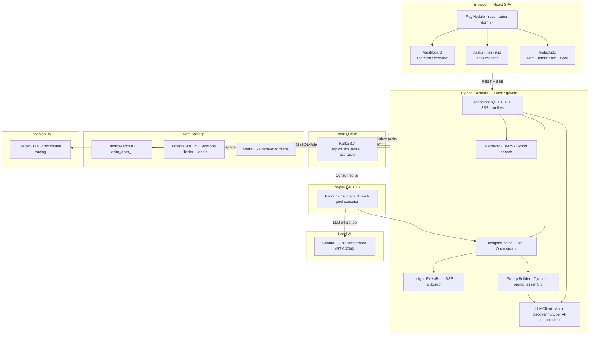
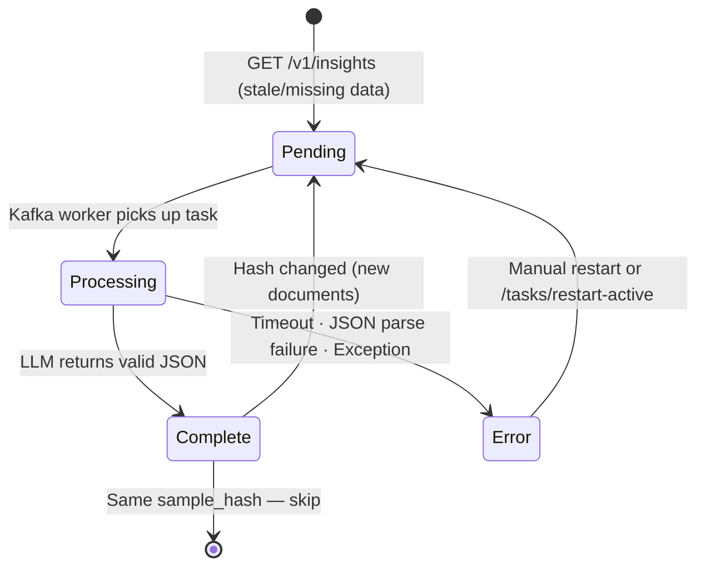

# QSINT RAG — Intelligence Platform

A production-grade **Retrieval-Augmented Generation (RAG)** platform for OSINT and intelligence analysis. Combines multi-index Elasticsearch document storage, a local GPU-accelerated LLM, streaming AI enrichment, and a full-featured React SPA for analysts to explore data, generate intelligence reports, track tasks, and chat with corpora in real time.

---

## Table of Contents

1. [Architecture](#1-architecture)
2. [Feature Overview](#2-feature-overview)
3. [Getting Started](#3-getting-started)
4. [Configuration](#4-configuration)
5. [API Reference](#5-api-reference)
6. [Data Flow](#6-data-flow)
7. [Performance Tuning](#7-performance-tuning)

---

## 1. Architecture



### Stack Components

| Service | Role |
|---------|------|
| `postgres` | Relational storage — sessions, messages, task cache, labels, saved searches, investigations |
| `elasticsearch` | High-performance document retrieval and aggregations |
| `kafka` + `zookeeper` | Durable task queue — LLM tasks and fast (stats) tasks on separate topics |
| `ollama` | GPU-accelerated LLM inference (OpenAI-compatible API) |
| `jaeger` | End-to-end distributed tracing via OTLP |
| `redis` | Framework-level cache |
| `kafka-ui` | Kafka topic browser (port `8090`) |
| `pgadmin` | PostgreSQL admin console |

---

## 2. Feature Overview

### 2.1 Intelligence Reports (Insights)

Eight specialised background tasks analyse the corpus and produce a structured intelligence report:

| Task | Type | Output |
|------|------|--------|
| `hot_topics_sentiment` | AI (LLM) | Discrete topics with sentiment scores |
| `trending_signals` | AI (LLM) | Rising/falling patterns and signal direction |
| `active_narratives` | AI (LLM) | High-level influence storylines |
| `relationship_network` | AI (LLM) | Entity-relationship graph (nodes + edges) |
| `corpus_statistics` | Fast (ES) | Document volume and temporal distribution |
| `top_regions` | Fast (ES) | Geographic focus areas |
| `top_entities` | Fast (ES) | Most frequent persons and organisations |
| `top_platforms` | Fast (ES) | Source domain/platform distribution |

**Intelligent deduplication**: Each task is fingerprinted with a SHA-256 hash of the current document sample. Tasks already `complete` for the same hash are skipped — only changed or failed tasks re-run.

**Stale-task detection**: Tasks stuck in `pending`/`processing` for > 10 minutes are automatically reset to `error` on the next status check, preventing a false "UPDATING" indicator in the UI.

### 2.2 RAG Chat

- Multi-turn chat backed by BM25 retrieval from any ES index
- Responses cite sources with relevance scores, date, and classification
- Session persistence across requests
- Streaming (`/v1/chat/stream`) and batch (`/v1/chat`) modes

### 2.3 Document Enrichment

Full AI enrichment pipeline per document:
- **IOC extraction** (IPs, domains, URLs, emails, hashes, CVEs, file paths, hashtags) — regex-only, instant
- **Sentiment analysis**
- **Entity recognition** (NER)
- **Timeline extraction**
- **Geo-coding** of extracted locations (via Nominatim/OSM)
- **Relationship graph** per document

Enrichment runs in the background via Kafka. Results are streamed back via SSE.

### 2.4 Saved Searches & Investigations

- **Saved Searches**: Named, reusable query + filter presets (query string, sentiment, date range, index patterns)
- **Investigations**: Combine multiple saved searches into a private ES index. Chat, enrichment, and intelligence reports all work against investigation indices

### 2.5 Task Monitor

Full audit trail of all background tasks with:
- Status, timing (queue time, execution time), error messages
- Per-task restart capability
- Bulk restart of all active tasks
- Analytics (average timing per task category)

### 2.6 LLM Auto-Discovery

At startup the `LLMClient` queries the Ollama server to:
1. Auto-discover the active model name (prefers instruct/chat models)
2. Read the configured context window (`num_ctx`) from the Modelfile
3. Feed window size to `PromptBuilder` for dynamic document packing

---

## 3. Getting Started

### Prerequisites

- Docker + Docker Compose
- Python 3.12+
- NVIDIA GPU with ≥ 8 GB VRAM (or CPU-only with reduced performance)

### Infrastructure Setup

```bash
# Clone and configure
cp .env.example .env   # or edit .env directly

# Start the full stack (Postgres, ES, Kafka, Ollama, Jaeger, Redis, etc.)
docker-compose up -d

# Watch model orchestration — pulls qwen2.5:3b-instruct and bakes 64k context
docker compose logs -f ollama-pull-model
```

### Backend (local dev)

```bash
python -m venv .venv && source .venv/bin/activate
pip install -r requirements.txt
python main.py
```

The API starts on `http://localhost:5100`. All endpoints live under `/rag/`.

### Seed Data

```bash
# Seed 2000 synthetic OSINT documents across 15 topic indices
python scripts/seed_elasticsearch.py
```

### Frontend

```bash
cd frontend
npm install
npm run dev   # http://localhost:5173
```

---

## 4. Configuration

All settings are loaded from `.env` via `src/config.py`.

### Core

| Variable | Default | Description |
|----------|---------|-------------|
| `API_PORT` | `5100` | HTTP server port |
| `DEV_MODE` | `true` | Enables verbose logging |
| `LOG_LEVEL` | `DEBUG` | Python log level |

### Datasource

| Variable | Default | Description |
|----------|---------|-------------|
| `DATASOURCE_TYPE` | `es` | `es` (Elasticsearch) or `file` (JSONL) |
| `ES_HOST` | `http://localhost:9200` | Elasticsearch URL |
| `ES_INDEX` | `qsint_docs` | Default index name |

### LLM

| Variable | Default | Description |
|----------|---------|-------------|
| `LLM_BASE_URL` | `http://localhost:11434/v1` | Ollama OpenAI-compat base URL |
| `LLM_TEMPERATURE` | `0.1` | LLM temperature |
| `LLM_TIMEOUT` | `120` | Hard wall-clock timeout per LLM call (seconds) |
| `LLM_INSIGHTS_CTX` | `65536` | Context window for insight tasks (tokens) |
| `LLM_INSIGHTS_MAX_TOKENS` | `1024` | Max output tokens for insight JSON |
| `LLM_INSIGHTS_INPUT_MAX_TOKENS` | `8500` | Max input tokens packed per insight prompt |
| `LLM_CHAT_CTX` | `16384` | Context window for chat sessions |
| `LLM_PARALLEL` | `10` | Max concurrent LLM calls via Kafka worker |

> **Note on `LLM_INSIGHTS_INPUT_MAX_TOKENS`**: Values below ~7 000 tokens trigger bimodal KV-cache alternation on Ollama (26s/52s alternating calls). 8 500 tokens ≈ 20 docs for simple tasks and ≈ 14 docs for `relationship_network`, giving consistent ~20–35 s per task.

### Retrieval

| Variable | Default | Description |
|----------|---------|-------------|
| `RAG_TOP_K` | `50` | BM25 candidate pool size |
| `RAG_RELATIVE_THRESHOLD` | `0.35` | Keep docs with score ≥ 35% of top score |
| `RAG_MAX_CONTEXT_CHUNKS` | `10` | Max chunks sent to LLM per chat turn |

### Insights

| Variable | Default | Description |
|----------|---------|-------------|
| `INSIGHTS_CACHE_TTL` | `1800` | Seconds before stale insights trigger refresh |
| `INSIGHTS_MAX_DOCS` | `2000` | Sample pool size for insight generation |

### Infrastructure

| Variable | Default | Description |
|----------|---------|-------------|
| `DATABASE_URL` | `postgresql://qf:qf@localhost:5432/qsint_rag` | Postgres connection string |
| `KAFKA_BOOTSTRAP_SERVERS` | `localhost:9094` | Kafka broker address |
| `KAFKA_TOPIC_LLM_TASKS` | `qsint.rag.llm_tasks` | Topic for LLM-heavy tasks |
| `KAFKA_TOPIC_FAST_TASKS` | `qsint.rag.fast_tasks` | Topic for fast ES-aggregation tasks |
| `REDIS_HOST` | `localhost` | Redis host |
| `ENABLE_TRACING` | `true` | Enable OTLP tracing to Jaeger |
| `QSINT_OTLP_ENDPOINT` | `http://localhost:4317` | Jaeger OTLP gRPC endpoint |

---

## 5. API Reference

All endpoints are prefixed with `/rag`. Base URL: `http://localhost:5100/rag`.

---

### Health & Status

#### `GET /health`
Returns API health, datasource status, and LLM connectivity.

```bash
curl http://localhost:5100/rag/health
```
```json
{
  "status": "ok",
  "datasource": { "type": "elasticsearch", "index": "qsint_docs_cyber", "doc_count": 1000 },
  "llm": { "model": "qwen2.5:3b-instruct", "ok": true }
}
```

#### `GET /liveness`
Minimal liveness probe (for load balancers).

#### `GET /v1/llm/stats`
Returns full LLM model metadata including license, context window, and parameter size.

```bash
curl http://localhost:5100/rag/v1/llm/stats
```

---

### Datasource

#### `GET /v1/datasource/status`
Returns connectivity and stats for the active datasource.

```bash
curl "http://localhost:5100/rag/v1/datasource/status"
```
```json
{ "type": "elasticsearch", "index": "qsint_docs_cyber", "doc_count": 1000, "status": "green" }
```

#### `GET /v1/datasource/indices`
Lists all available `qsint_docs*` indices.

```bash
curl http://localhost:5100/rag/v1/datasource/indices
```
```json
{ "indices": ["qsint_docs_cyber", "qsint_docs_geopolitics", "qsint_docs_terrorism"] }
```

---

### Documents

#### `GET /v1/documents`
Paginated document list with optional search and filters.

| Parameter | Type | Description |
|-----------|------|-------------|
| `datasource` | string | ES index name (required) |
| `limit` | int | Page size (default 50) |
| `offset` | int | Pagination offset |
| `query` | string | Full-text search |
| `sentiment` | string | Filter by sentiment |

```bash
curl "http://localhost:5100/rag/v1/documents?datasource=qsint_docs_cyber&limit=5&query=GRU"
```
```json
{
  "documents": [ { "id": "...", "title": "...", "text": "...", "sentiment": "hostile", ... } ],
  "total": 42
}
```

#### `GET /v1/documents/enriched`
Lists documents that have completed enrichment for a datasource.

```bash
curl "http://localhost:5100/rag/v1/documents/enriched?datasource=qsint_docs_cyber"
```
```json
{ "doc_ids": ["id1", "id2"], "total": 2 }
```

#### `GET|POST /v1/documents/status`
Get or set analyst review status (`in_progress` / `done`) for documents.

```bash
# Get all statuses for an index
curl "http://localhost:5100/rag/v1/documents/status?datasource=qsint_docs_cyber"

# Set status for a document
curl -X POST http://localhost:5100/rag/v1/documents/status \
  -H "Content-Type: application/json" \
  -d '{ "datasource": "qsint_docs_cyber", "doc_id": "abc123", "status": "in_progress" }'
```

#### `GET|POST /v1/documents/labels`
Get or set analyst labels (free-form tags) for documents.

```bash
# Get all labels for an index
curl "http://localhost:5100/rag/v1/documents/labels?datasource=qsint_docs_cyber"

# Set labels for a document
curl -X POST http://localhost:5100/rag/v1/documents/labels \
  -H "Content-Type: application/json" \
  -d '{ "datasource": "qsint_docs_cyber", "doc_id": "abc123", "labels": ["priority", "case-42"] }'
```
```json
{ "doc_id": "abc123", "datasource": "qsint_docs_cyber", "labels": ["case-42", "priority"] }
```

---

### Document Enrichment

#### `POST /v1/documents/enrich`
Queue full AI enrichment for a document. Returns immediately (background task).

```bash
curl -X POST http://localhost:5100/rag/v1/documents/enrich \
  -H "Content-Type: application/json" \
  -d '{ "doc_id": "abc123", "datasource": "qsint_docs_cyber", "text": "Full document text..." }'
```
```json
{ "doc_id": "abc123", "datasource": "qsint_docs_cyber", "status": "pending", "payload": null }
```

Once complete, the enrichment payload contains:
- `iocs` — IPs, domains, URLs, emails, hashes, CVEs, file paths, hashtags
- `sentiment` — document-level sentiment
- `entities` — named entity list
- `timeline` — extracted events with dates
- `geo` — geocoded locations
- `graph` — entity relationship graph

#### `POST /v1/documents/enrich/stream`
Same as above but streams enrichment results via SSE as each field completes.

```bash
curl -N -X POST http://localhost:5100/rag/v1/documents/enrich/stream \
  -H "Content-Type: application/json" \
  -d '{ "doc_id": "abc123", "datasource": "qsint_docs_cyber", "text": "..." }'
```
Server-Sent Events:
```
data: {"field": "iocs", "value": {"ips": ["1.2.3.4"], "domains": ["example.com"]}}

data: {"field": "sentiment", "value": "hostile"}

data: {"field": "entities", "value": [{"name": "GRU Unit 74455", "type": "ORG"}]}

data: {"complete": true}
```

#### `POST /v1/documents/enrich/field`
Re-enrich a single field only (useful for retrying a failed field).

```bash
curl -X POST http://localhost:5100/rag/v1/documents/enrich/field \
  -H "Content-Type: application/json" \
  -d '{ "doc_id": "abc123", "datasource": "qsint_docs_cyber", "field": "entities", "text": "..." }'
```

---

### Chat (RAG)

#### `POST /v1/chat`
Batch RAG chat. Retrieves relevant documents and returns a full response with sources.

```bash
curl -X POST http://localhost:5100/rag/v1/chat \
  -H "Content-Type: application/json" \
  -d '{
    "message": "What are the main cyber threats from GRU units?",
    "datasource": "qsint_docs_cyber",
    "session_id": "optional-session-uuid"
  }'
```
```json
{
  "session_id": "...",
  "message_id": "...",
  "content": "Based on the retrieved documents...",
  "sources": [
    {
      "id": "...",
      "title": "Troll Farm Activity — GRU Unit 74455",
      "score": 1.0,
      "text": "...",
      "date": "2026-02-19",
      "datasource": "qsint_docs_cyber"
    }
  ]
}
```

#### `POST /v1/chat/stream`
Streaming RAG chat via SSE. Returns tokens as they are generated.

```bash
curl -N -X POST http://localhost:5100/rag/v1/chat/stream \
  -H "Content-Type: application/json" \
  -d '{ "message": "Summarise the latest disinformation campaigns", "datasource": "qsint_docs_disinformation" }'
```
```
data: {"token": "Based"}
data: {"token": " on"}
...
data: {"sources": [...], "session_id": "...", "complete": true}
```

---

### Sessions

#### `GET /v1/sessions`
List all chat sessions (most recent first).

```bash
curl "http://localhost:5100/rag/v1/sessions?datasource=qsint_docs_cyber"
```

#### `POST /v1/sessions`
Create a new chat session.

```bash
curl -X POST http://localhost:5100/rag/v1/sessions \
  -H "Content-Type: application/json" \
  -d '{ "title": "GRU Investigation Session", "datasource": "qsint_docs_cyber" }'
```

#### `GET /v1/sessions/<session_id>`
Get session details.

#### `PATCH /v1/sessions/<session_id>`
Rename a session.

```bash
curl -X PATCH http://localhost:5100/rag/v1/sessions/SESSION_ID \
  -H "Content-Type: application/json" \
  -d '{ "title": "New Session Title" }'
```

#### `DELETE /v1/sessions/<session_id>`
Delete a session and all its messages.

#### `GET /v1/sessions/<session_id>/messages`
Get full message history for a session.

---

### Intelligence Reports (Insights)

#### `GET /v1/insights`
Get the current intelligence report state. Triggers background refresh if data is stale (TTL expired) or missing.

```bash
curl "http://localhost:5100/rag/v1/insights?datasource=qsint_docs_cyber"
```
```json
{
  "tasks": {
    "hot_topics_sentiment": {
      "status": "complete",
      "generated_at": "2026-04-12T20:00:00Z",
      "payload": {
        "topics": [
          { "topic": "cyber espionage", "sentiment": "hostile", "score": 0.85 }
        ]
      }
    },
    "relationship_network": {
      "status": "complete",
      "payload": {
        "nodes": [{ "id": "GRU Unit 74455", "label": "GRU Unit 74455", "type": "ORG" }],
        "edges": [{ "source": "GRU Unit 74455", "target": "NATO", "label": "targets" }]
      }
    }
  },
  "_meta": {
    "datasource": "qsint_docs_cyber",
    "is_processing": false,
    "refresh_triggered": false
  }
}
```

#### `POST /v1/insights/refresh`
Force-refresh all intelligence tasks for a datasource (ignores TTL and sample hash).

```bash
curl -X POST http://localhost:5100/rag/v1/insights/refresh \
  -H "Content-Type: application/json" \
  -d '{ "datasource": "qsint_docs_cyber" }'
```

#### `DELETE /v1/insights`
Delete cached insights, forcing full regeneration on next GET.

```bash
curl -X DELETE "http://localhost:5100/rag/v1/insights?datasource=qsint_docs_cyber"
```

#### `GET /v1/insights/stream`
SSE stream of insight task status updates for live UI refresh.

```bash
curl -N "http://localhost:5100/rag/v1/insights/stream?datasource=qsint_docs_cyber"
```
```
data: {"task_type": "hot_topics_sentiment", "status": "processing", "datasource": "qsint_docs_cyber"}

data: {"task_type": "hot_topics_sentiment", "status": "complete", "datasource": "qsint_docs_cyber"}
```

#### `POST /v1/insights/task/refresh`
Restart a single insight task by type.

```bash
curl -X POST http://localhost:5100/rag/v1/insights/task/refresh \
  -H "Content-Type: application/json" \
  -d '{ "datasource": "qsint_docs_cyber", "task_type": "relationship_network" }'
```

---

### Tasks

#### `GET /v1/tasks`
List all tasks (insight + enrichment) with filtering and pagination.

| Parameter | Description |
|-----------|-------------|
| `datasource` | Filter by datasource |
| `category` | `insight` or `enrichment` |
| `status` | `pending`, `processing`, `complete`, `error` |
| `limit` | Page size |
| `offset` | Pagination offset |

```bash
curl "http://localhost:5100/rag/v1/tasks?datasource=qsint_docs_cyber&status=complete&limit=10"
```

#### `GET /v1/tasks/analytics`
Aggregate timing statistics grouped by task type and category.

```bash
curl "http://localhost:5100/rag/v1/tasks/analytics?datasource=qsint_docs_cyber"
```
```json
{
  "timing": [
    { "category": "insight", "task_type": "relationship_network", "avg_exec_ms": 32500, "sample_count": 5 }
  ]
}
```

#### `GET /v1/tasks/<task_id>`
Get detailed info and full output payload for a specific task.

```bash
curl "http://localhost:5100/rag/v1/tasks/insight__qsint_docs_cyber__relationship_network"
```

#### `POST /v1/tasks/restart-active`
Bulk-restart all `pending` or `processing` tasks (useful after worker crash).

```bash
curl -X POST http://localhost:5100/rag/v1/tasks/restart-active \
  -H "Content-Type: application/json" \
  -d '{ "datasource": "qsint_docs_cyber" }'
```

#### `GET /v1/dashboard/tasks`
Compact task summary for the dashboard overview.

#### `POST /v1/dashboard/tasks/restart`
Restart a specific task from the dashboard.

#### `DELETE /v1/dashboard/tasks`
Clear all completed/error tasks for a datasource.

---

### Saved Searches

#### `GET /v1/searches`
List all saved searches.

```bash
curl http://localhost:5100/rag/v1/searches
```

#### `POST /v1/searches`
Create a new saved search.

```bash
curl -X POST http://localhost:5100/rag/v1/searches \
  -H "Content-Type: application/json" \
  -d '{
    "name": "GRU Cyber Operations",
    "description": "All GRU-attributed cyber espionage cases",
    "query": "GRU cyber espionage",
    "filters": {
      "sentiment": "hostile",
      "index_patterns": ["qsint_docs_cyber"],
      "date_from": "2025-01-01",
      "date_to": "2026-12-31"
    }
  }'
```
```json
{
  "id": "e874eda7-...",
  "name": "GRU Cyber Operations",
  "query": "GRU cyber espionage",
  "filters": { "sentiment": "hostile", "index_patterns": ["qsint_docs_cyber"] }
}
```

#### `PUT /v1/searches/<search_id>`
Update a saved search (full replace).

```bash
curl -X PUT http://localhost:5100/rag/v1/searches/SEARCH_ID \
  -H "Content-Type: application/json" \
  -d '{ "name": "Updated Name", "query": "new query", "filters": {} }'
```

#### `DELETE /v1/searches/<search_id>`
Delete a saved search.

```bash
curl -X DELETE http://localhost:5100/rag/v1/searches/SEARCH_ID
```

---

### Investigations

Investigations combine multiple saved searches into a private ES index for focused analysis. The UI wizard provides a 5-step creation flow: Name → Searches → Scrapers (mock) → Auto-enrichment → Review.

#### `GET /v1/investigations`
List all investigations.

```bash
curl http://localhost:5100/rag/v1/investigations
```
```json
{
  "investigations": [
    {
      "id": "44429cab-...",
      "name": "GRU Infrastructure",
      "index_name": "inv_gru_infrastructure_44429cab",
      "status": "ready",
      "doc_count": 127,
      "search_ids": ["e874eda7-..."]
    }
  ]
}
```

#### `POST /v1/investigations`
Create a new investigation. Immediately returns `202 Accepted` — background task populates the ES index.

```bash
curl -X POST http://localhost:5100/rag/v1/investigations \
  -H "Content-Type: application/json" \
  -d '{
    "name": "GRU Infrastructure",
    "description": "Cross-index GRU attribution analysis",
    "search_ids": ["e874eda7-...", "b12cafe0-..."]
  }'
```
```json
{
  "id": "44429cab-...",
  "name": "GRU Infrastructure",
  "index_name": "inv_gru_infrastructure_44429cab",
  "status": "creating",
  "search_ids": ["e874eda7-..."]
}
```

Once the background task completes, `status` transitions to `ready` (or `error`). Poll `GET /v1/investigations/<id>` or watch the Task Monitor.

> The investigation index (`inv_gru_infrastructure_44429cab`) can be used as a `datasource` in **all other endpoints** — chat, insights, enrichment, documents, labels, etc.

**Auto-enrichment after index creation** — to automatically enrich the first N documents once the investigation is ready, poll status and then batch-enrich:

```bash
INV_IDX="inv_gru_infrastructure_44429cab"
N=10

# 1. Wait for status=ready
until [[ "$(curl -s http://localhost:5100/rag/v1/investigations/44429cab-... | python3 -c "import json,sys; print(json.load(sys.stdin)['status'])")" == "ready" ]]; do
  sleep 2
done

# 2. Fetch first N docs and enrich each
curl -s "http://localhost:5100/rag/v1/documents?datasource=$INV_IDX&limit=$N" | python3 -c "
import json, sys, subprocess
for doc in json.load(sys.stdin)['documents']:
    payload = json.dumps({'doc_id': doc['id'], 'datasource': '$INV_IDX', 'text': doc.get('text','')})
    subprocess.run(['curl','-s','-X','POST','http://localhost:5100/rag/v1/documents/enrich',
                    '-H','Content-Type: application/json','-d',payload], capture_output=True)
    print(f'Queued: {doc[\"id\"][:12]}...')
"
```

The UI wizard does this automatically when "Auto-enrichment" is enabled — it triggers after the investigation status transitions to `ready`.

#### `GET /v1/investigations/<investigation_id>`
Get investigation status and metadata.

```bash
curl http://localhost:5100/rag/v1/investigations/44429cab-...
```

#### `DELETE /v1/investigations/<investigation_id>`
Delete the investigation row from Postgres and drop the ES index.

```bash
curl -X DELETE http://localhost:5100/rag/v1/investigations/44429cab-...
```

---

## 6. Data Flow

### Intelligence Report Lifecycle



**Stuck task detection**: Tasks in `pending`/`processing` for > 10 minutes are reset to `error` automatically on the next `GET /v1/insights` call, preventing a permanent "UPDATING" UI state when the worker is not running.

### Investigation Creation Flow

**UI Wizard — 5 steps:**
1. **Name** — investigation name and description
2. **Searches** — select saved searches to seed the index
3. **Scrapers** *(mock, future)* — configure YouTube / Facebook / TikTok / Telegram sources with URLs and date ranges
4. **Auto-enrichment** — optionally enrich the first N documents automatically once the index is ready
5. **Review** — confirm and create

**Backend flow:**
```
POST /v1/investigations
    │
    ├─ Create DB row (status=creating)
    ├─ Publish "create_investigation" task → Kafka
    └─ Return 202 Accepted

Kafka Worker:
    ├─ Create ES index (inv_*)
    ├─ For each search_id:
    │   ├─ Load saved search (query + filters)
    │   └─ Scroll+bulk-copy matching docs from source indices
    │       (falls back to qsint_docs* wildcard when no index_patterns set)
    └─ Update DB row (status=ready, doc_count=N)

UI (on status → ready):
    └─ If auto-enrich enabled:
        ├─ Fetch first N docs from investigation index
        ├─ POST /v1/documents/enrich for each doc (parallel)
        └─ Show notification + "Auto-enriching N of total" tag in header
```

### Document Enrichment Flow

```
POST /v1/documents/enrich
    │
    ├─ IOC extraction (regex, synchronous)
    ├─ Geo-coding (Nominatim, synchronous)
    ├─ Publish "enrich_doc" → Kafka (LLM queue)
    └─ Return {status: pending}

Kafka Worker (enrich_doc):
    ├─ Sentiment analysis (LLM)
    ├─ Named entity recognition (LLM)
    ├─ Timeline extraction (LLM)
    ├─ Relationship graph (LLM)
    └─ Persist to DocumentEnrichment table
```

---

## 7. Performance Tuning

### GPU/VRAM Optimisation (RTX 3080 — 10 GB VRAM)

The recommended Ollama configuration for a single 10 GB GPU:

```yaml
# docker-compose.yml — ollama service
environment:
  - OLLAMA_NUM_PARALLEL=1      # 1 slot prevents KV-cache overflow
  - OLLAMA_FLASH_ATTN=1        # Reduces VRAM by ~30%
  - OLLAMA_KV_CACHE_TYPE=q8_0  # 8-bit KV quantisation (~1.2 GB at 64k context)
```

With these settings:
- Full 64k context window fits in VRAM (KV ≈ 1.2 GB for 3B model)
- No RAM spillover → consistent 20–35 s per insight task
- `OLLAMA_NUM_PARALLEL=1` is required; 3 parallel slots × 4.3 GB KV = 12.9 GB > 10 GB

### Input Token Budget

`LLM_INSIGHTS_INPUT_MAX_TOKENS=8500` is the tested optimum:

| Value | Docs packed | Pattern |
|-------|------------|---------|
| < 7 000 | ~8 docs | Bimodal 26s/52s — KV cache eviction alternates |
| 8 500 (default) | ~14–20 docs | Consistent 20–35 s — prefix cache hits reliably |
| > 16 000 | 40+ docs | JSON coherence degrades on 3B models |

### LLM Parallelism

Set `LLM_PARALLEL` based on your GPU:

| GPU | Recommended `LLM_PARALLEL` |
|-----|---------------------------|
| RTX 3080 (10 GB) | `1` (single slot) |
| RTX 4090 (24 GB) | `3–5` |
| Multi-GPU | `N × slots` |

### Task Queue Routing

Fast ES-aggregation tasks are routed to `KAFKA_TOPIC_FAST_TASKS` so they never queue behind slow LLM calls:

```
llm_tasks  ← trending_signals, active_narratives, hot_topics_sentiment, relationship_network
fast_tasks ← corpus_statistics, top_regions, top_entities, top_platforms
```

### Startup Task Recovery

On every app restart, `main.py` scans the DB for tasks interrupted by the previous session:
- **Insight tasks** (`pending`/`processing`) → reset to `pending` and republished to Kafka
- **Enrichment `processing`** → marked `error` (text not stored; user re-triggers)
- **Enrichment `pending`** → text fetched from ES and republished
