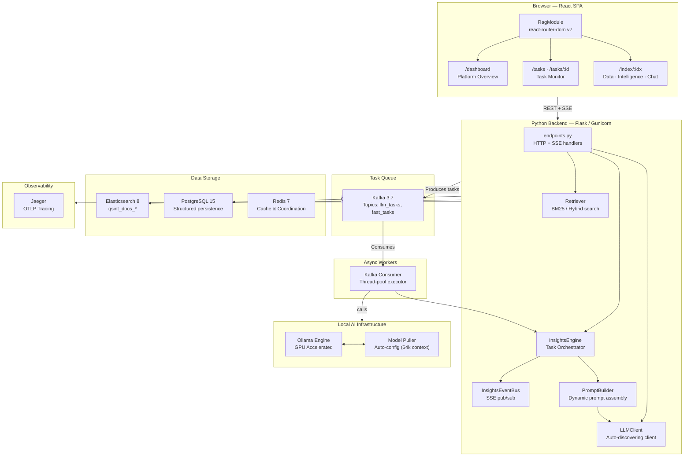
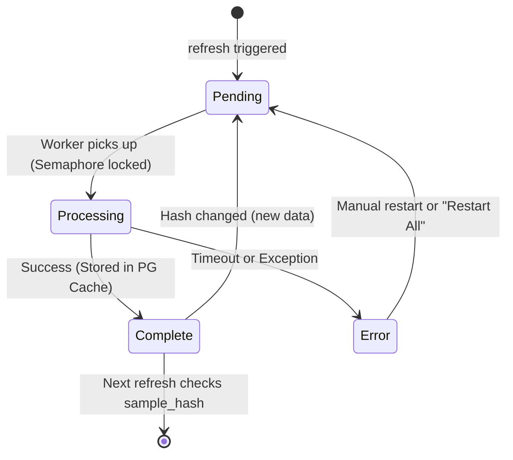

# QSINT RAG — Intelligence Platform

A production-grade **Retrieval-Augmented Generation (RAG)** platform built for OSINT and intelligence analysis. Combines multi-index Elasticsearch document storage, a local or API-hosted LLM, streaming AI enrichment, and a full-featured React SPA to let analysts explore data, generate intelligence reports, track tasks, and chat with corpora in real time.

---

## 1. Architecture

The system follows a decoupled, event-driven architecture designed for high availability and horizontal scalability.

### System Overview


---

## 2. Technical Features & Decoupling

### 2.1 Dynamic LLM Configuration
The platform is fully decoupled from specific LLM models. At startup, the `LLMClient` queries the Ollama server to:
1.  **Auto-discover** the active model name (prioritizing orchestrated instruct models).
2.  **Sense** the available context window (`num_ctx`) baked into the model.
3.  **Adaptive Packing**: The `PromptBuilder` uses this sensed window to dynamically calculate how many documents can fit into a single analysis prompt.

### 2.2 Granular Intelligence Tasks
The monolithic "Summary" and "Graph" tasks have been split into 8 specialized components to ensure low latency and high reliability:

| Task Type | Category | Description |
|-----------|----------|-------------|
| `trending_signals` | AI | Rising/falling patterns and signal direction. |
| `active_narratives` | AI | High-level storylines and influence vectors. |
| `hot_topics_sentiment` | AI | Discrete topic listing with sentiment scores. |
| `relationship_network` | AI | Community entity-relationship graph (replaces legacy graph). |
| `corpus_statistics` | Fast | Overall document volume and temporal distribution. |
| `top_regions` | Fast | Geographic focus areas via ES aggregations. |
| `top_entities` | Fast | Most frequent persons and organizations. |
| `top_platforms` | Fast | Distribution of source domains/platforms. |

### 2.3 Intelligent Task Deduplication
To prevent redundant work, the system uses a **Sample Hashing** mechanism:
- A fingerprint (SHA-256) is generated for the current corpus window.
- If a sub-task (e.g., `top_regions`) is already `complete` for that specific hash, the system **automatically skips** it.
- This allows for incremental updates—only re-running components that failed or if the underlying data has changed.

---

## 3. Platform Orchestration (Docker)

The platform runs as a 10-container stack. A key feature is the **Model Orchestrator**, which ensures the LLM environment is production-ready without manual intervention.

```yaml
  # Automated model puller and 64k context baker
  ollama-pull-model:
    image: ollama/ollama:latest
    depends_on:
      ollama:
        condition: service_healthy
    command: >
      sh -c "ollama pull qwen2.5:3b-instruct && 
             echo 'FROM qwen2.5:3b-instruct\nPARAMETER num_ctx 65536' | ollama create qwen2.5:3b-instruct -f -"
```

### Stack Components:
- **`postgres`**: Relational data (sessions, task cache, labels).
- **`elasticsearch`**: High-performance document retrieval.
- **`kafka` & `zookeeper`**: Durable task distribution.
- **`ollama`**: GPU-accelerated LLM inference.
- **`jaeger`**: End-to-end distributed tracing.
- **`redis`**: Low-latency caching.
- **`kafka-ui` / `pgadmin`**: Infrastructure management consoles.

---

## 4. Getting Started

### Infrastructure Setup
```bash
# 1. Start the complete stack
docker-compose up -d

# 2. Monitor model orchestration (takes 1-2 mins to pull and configure 64k ctx)
docker compose logs -f ollama-pull-model
```

### Local Backend Development
The backend is designed to run directly on the host for maximum performance and debugging capability.
```bash
python -m venv .venv && source .venv/bin/activate
pip install -r requirements.txt
python main.py
```

### Verification
Once started, the **Platform Overview** (`/overview`) UI will show:
- **LLM Engine Details**: Sensed model name, parameter size, and the verified 64k context window.
- **Overall task completion**: Granular progress of all 8 intelligence sub-tasks.

---

## 5. Data Flow Diagrams

### Insights Task Lifecycle


### Database Stability (Concurrency Fix)
The system implements **Pessimistic Connection Validation** to resolve libpq transaction corruption in multi-threaded environments:
1.  **Checkout Ping**: Every DB session checkout performs a `SELECT 1`.
2.  **Explicit Consumption**: The code now explicitly calls `fetchone()` to consume the ping result, preventing `PGRES_TUPLES_OK` ghost states from corrupting subsequent intelligence queries.

---

## 6. API Reference

| Method | Endpoint | Description |
|--------|----------|-------------|
| `GET` | `/v1/llm/stats` | Returns dynamically discovered model metadata. |
| `POST` | `/v1/tasks/restart-active` | Bulk re-queues all `pending` or `processing` tasks. |
| `GET` | `/v1/insights` | Fetches the granular intelligence report state. |
| `POST` | `/v1/chat/stream` | Multi-source RAG chat with citing support. |

---

## 7. Performance Optimization

- **LLM Parallelism**: Configurable via `LLM_PARALLEL`. Recommended `3` for 10GB VRAM GPUs (3080/4080).
- **Context Capping**: Graph and Narrative tasks are capped at **32k tokens** for input to prevent LLM timeouts, while utilizing the full **64k server window** for reasoning overhead.
- **Async Stats**: Aggregation tasks (regions, entities) are routed to a `fast_tasks` queue, ensuring they never wait for the GPU-heavy LLM tasks.
