# QSINT RAG — Intelligence Platform

A production-grade **Retrieval-Augmented Generation (RAG)** platform built for OSINT and intelligence analysis. Combines multi-index Elasticsearch document storage, a local or API-hosted LLM, streaming AI enrichment, and a full-featured React SPA to let analysts explore data, generate intelligence reports, track tasks, and chat with corpora in real time.

---

## Table of Contents

1. [Architecture](#architecture)
2. [Tech Stack](#tech-stack)
3. [Getting Started](#getting-started)
4. [Configuration](#configuration)
5. [Feature Reference](#feature-reference)
   - [Platform Overview / Dashboard](#1-platform-overview--dashboard)
   - [Task Monitor](#2-task-monitor)
   - [Data Exploration](#3-data-exploration)
   - [Document Labels & Tags](#4-document-labels--tags)
   - [AI Document Enrichment (SSE Streaming)](#5-ai-document-enrichment-sse-streaming)
   - [Advanced Search & Filtering](#6-advanced-search--filtering)
   - [Intelligence Report](#7-intelligence-report)
   - [RAG Chat](#8-rag-chat)
   - [Distributed Tracing (Jaeger)](#9-distributed-tracing-jaeger)
6. [API Reference](#api-reference)
7. [Data Flow Diagrams](#data-flow-diagrams)
8. [Database Schema](#database-schema)
9. [Backend Components](#backend-components)
10. [Frontend Components](#frontend-components)
11. [Development Guide](#development-guide)

---

## Architecture

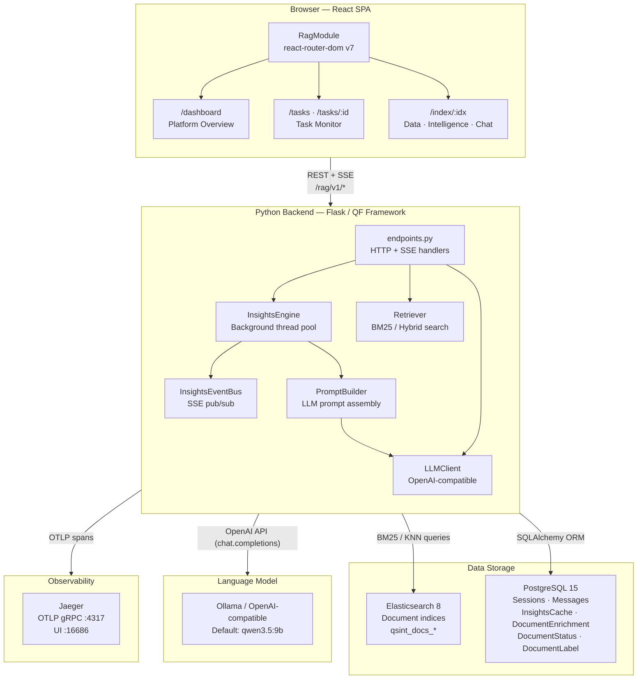

---

## Tech Stack

| Layer | Technology | Notes |
|-------|-----------|-------|
| Frontend | React 18, TypeScript | Vite + SWC build |
| UI Components | Ant Design 5 | Dark / light theme |
| Routing | react-router-dom v7 | URL-based, browser-refresh safe |
| Data fetching | TanStack Query v5 | Cache + background refetch |
| Visualisations | D3.js, react-force-graph-2d, react-wordcloud | Force graph, word cloud, area charts |
| Backend | Python 3.12, Flask | Via QF Framework WSGI runner |
| ORM | SQLAlchemy 2.x | Sync session via `get_db()` context manager |
| Search | Elasticsearch 8.x | BM25 + optional dense_vector KNN |
| LLM | Ollama (local GPU) or any OpenAI-compatible endpoint | Tested with qwen3.5:9b |
| Streaming | Server-Sent Events (SSE) | Chat, insights, enrichment |
| Tracing | OpenTelemetry → Jaeger | Spans on every LLM call |
| Containers | Docker Compose | Postgres, ES, Ollama, Jaeger, Backend, Frontend |
| Geocoding | Nominatim (OpenStreetMap) | Location extraction + lat/lon resolution |
| IOC extraction | Regex patterns | IPs, domains, hashes, CVEs, emails, crypto addresses |

---

## Getting Started

### Prerequisites

- Docker + Docker Compose v2
- Node.js 20+ (frontend dev only)
- Python 3.12+ with virtualenv (backend dev only)
- Ollama with a model pulled: `ollama pull qwen3.5:9b`

### Full Stack via Docker Compose

```bash
# 1. Clone the repository
git clone <repo-url> && cd rag-poc

# 2. Configure environment
cp .env.example .env
# Edit .env — at minimum verify LLM_BASE_URL and DATABASE_URL

# 3. Start all services (Postgres, Elasticsearch, Ollama, Jaeger, Backend, Frontend)
docker-compose up -d

# 4. Wait for services to be healthy, then seed sample data
docker exec qsint-rag-backend python scripts/seed_elasticsearch.py

# 5. Open the UI
open http://localhost:5173
# Jaeger tracing UI
open http://localhost:16686
```

### Local Development (no Docker for app code)

```bash
# Infrastructure only
docker-compose up -d postgres elasticsearch jaeger

# Backend
python -m venv .venv
source .venv/bin/activate
pip install -r requirements.txt
python main.py
# → API available at http://localhost:5100/rag

# Frontend
cd frontend
npm install
npm run dev
# → UI at http://localhost:5173
```

### Seed Multiple Indices

```bash
# Create and populate multiple regional indices
python scripts/seed_elasticsearch.py --index qsint_docs_europe --count 5000
python scripts/seed_elasticsearch.py --index qsint_docs_apac   --count 3000
python scripts/seed_elasticsearch.py --index qsint_docs_latam  --count 2000
```

All seeded indices appear automatically in the sidebar without any configuration change.

---

## Configuration

All parameters live in `.env` (loaded via python-dotenv at startup):

```env
# ── Application ────────────────────────────────────────────────────────────────
API_PORT=5100
DEV_MODE=true
LOG_LEVEL=DEBUG

# ── PostgreSQL ─────────────────────────────────────────────────────────────────
DATABASE_URL=postgresql://qf:qf@localhost:5432/qsint_rag

# ── Elasticsearch ──────────────────────────────────────────────────────────────
ES_HOST=http://localhost:9200
ES_INDEX=qsint_docs          # default index (fallback)
ES_USER=                     # leave empty for no-auth clusters
ES_PASSWORD=

# ── Datasource backend ─────────────────────────────────────────────────────────
# "es"   → Elasticsearch (production default)
# "file" → local JSONL/CSV/TXT file (quick testing without ES)
DATASOURCE_TYPE=es
FILE_DATASOURCE_PATH=./data/corpus.jsonl

# ── LLM ────────────────────────────────────────────────────────────────────────
LLM_BASE_URL=http://localhost:11434/v1   # Ollama default; swap for OpenAI, etc.
LLM_MODEL=qwen3.5:9b
LLM_MAX_TOKENS=4096
LLM_TEMPERATURE=0.3

# ── RAG retrieval ──────────────────────────────────────────────────────────────
RAG_TOP_K=20                 # chunks retrieved from ES per query
RAG_SCORE_THRESHOLD=0.15     # minimum BM25 score; 0.0 disables filtering
RAG_MAX_CONTEXT_CHUNKS=20    # max chunks passed to LLM after score filtering
HISTORY_TURNS=10             # conversation history window (turns)

# ── Insights generation ────────────────────────────────────────────────────────
INSIGHTS_CACHE_TTL=1800            # seconds before insights are considered stale
INSIGHTS_MAX_DOCS=500              # docs sampled for AI analysis (titles+topics only)
INSIGHTS_MAX_DOCS_FULL_TEXT=40     # hard cap when full text is needed (enrichment)

# ── Tracing ────────────────────────────────────────────────────────────────────
ENABLE_TRACING=true                # set false to disable all OTel instrumentation
QSINT_OTLP_ENDPOINT=http://localhost:4317
```

---

## Feature Reference

### 1. Platform Overview / Dashboard

**Route:** `/dashboard`

A high-level control panel that aggregates the status of every background task across all datasources.

**What it shows:**

- **Insight tasks** — one row per `(datasource, insight_type)` pair. Insight types: `summary`, `ner`, `graph`, `stats`. Each task has a live status badge (Pending / Processing / Complete / Error) with an animated spinner during processing.
- **Enrichment tasks** — one row per `(datasource, doc_id)` pair for every document that has been enriched.
- **Overall progress bar** — percentage of tasks in Complete state across both categories.
- **Auto-refresh** every 10 seconds via TanStack Query.

**Actions per task:**
- **Restart** — re-queues the task (resets to Pending, triggers background worker).
- **Delete** — removes the task record from PostgreSQL entirely.
- **Click row** → navigates to `/tasks/:id` for full detail.

**Navigate to Task Monitor button** opens the full filterable task list at `/tasks`.

---

### 2. Task Monitor

**Route:** `/tasks` and `/tasks/:id`

#### Task List (`/tasks`)

Filterable, sortable table of all tasks across all datasources. Click any row to open the detail page.

#### Task Detail (`/tasks/:id`)

Full drill-down for a single task:

| Field | Description |
|-------|-------------|
| Status | Live badge with icon |
| Category | `insight` or `enrichment` |
| Type | Insight sub-type or enrichment field |
| Datasource | The Elasticsearch index this task ran against |
| Document ID | Present for enrichment tasks (links to the document) |
| Retry count | Highlighted orange/red if > 0 |
| Has output | Whether a `payload` JSON exists |
| Created / Started / Updated | Local timezone with UTC tooltip on hover |
| Sample hash | First 16 chars of the corpus sample fingerprint |

**Latency breakdown bar** — a proportional bar chart showing queue wait time vs. execution time, with absolute durations below.

**Navigation buttons:**
- `Go to doc` (enrichment tasks) — opens `/index/:datasource/:doc_id` and pins that document open in Data Exploration.
- `Go to report` (insight tasks) — opens `/index/:datasource` and switches directly to the Intelligence Report tab.

**Actions:** Restart, Delete (with confirmation popover).

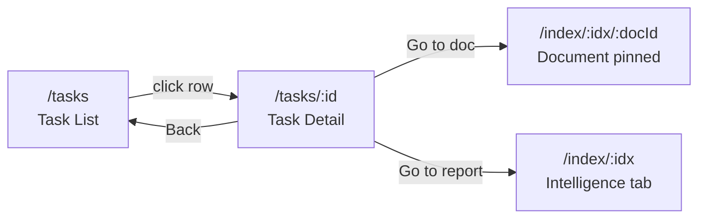

---

### 3. Data Exploration

**Route:** `/index/:idx` → **Data Exploration** tab

Split-panel interface for browsing and analysing Elasticsearch documents.

#### Document Table

- Paginated list of documents from the selected index (`offset`/`limit`).
- Columns: ID (truncated), title, sentiment badge, status badge, labels chips, created date.
- Click any row → right panel slides open with full document content and AI enrichment.
- **Multi-select** checkboxes → **Send N docs to RAG** button pre-loads selected documents as context in the RAG Chat tab.

#### Right Panel — Document Detail

Tabs and sections within the right panel:

| Section | Content |
|---------|---------|
| Full text | Complete raw document body, scrollable |
| Metadata | All Elasticsearch `_source` fields except text, rendered as key-value pairs |
| Labels | Analyst-assigned tags (see [Section 4](#4-document-labels--tags)) |
| AI Enrichment | Streamed enrichment panels (see [Section 5](#5-ai-document-enrichment-sse-streaming)) |

**Labels column** in the table shows all tags assigned to each document at a glance.

---

### 4. Document Labels & Tags

Analysts can attach free-form labels to any document. Labels are stored in PostgreSQL (not Elasticsearch), are deduplicated, and are limited to 50 characters each.

#### Adding labels

In the Document Detail right panel, a **Labels** section shows:
- Current label chips with ✕ delete buttons.
- **Add existing label** — a searchable Select dropdown populated with all labels currently used in the datasource (for quick reuse across analysts).
- **New label** input — type a custom label and press Enter or click Add.

#### Example workflow

```
Analyst opens doc 0de2aaba... in qsint_docs_europe
→ Types "election-2026" in the new label input → Enter
→ Types "priority-1" → Enter
→ Doc now shows chips: [election-2026] [priority-1]

Next analyst opens the filter bar → Labels → selects "election-2026"
→ Table shows only docs tagged with that label
```

#### Storage model

```sql
-- rag_document_labels
CREATE TABLE rag_document_labels (
  doc_id     VARCHAR(255) NOT NULL,
  datasource VARCHAR(100) NOT NULL,
  labels     JSON         NOT NULL DEFAULT '[]',
  updated_at TIMESTAMP    NOT NULL,
  PRIMARY KEY (doc_id, datasource)
);
```

Labels are stored as a JSON array. An empty array deletes the row.

---

### 5. AI Document Enrichment (SSE Streaming)

When a document is opened for the first time, the backend streams enrichment results step-by-step via **Server-Sent Events**. Each step completes independently and its panel appears immediately — the analyst does not wait for all steps to finish.

#### Enrichment steps (in order)

| Step | Field | Method | Typical latency |
|------|-------|--------|----------------|
| 1 | Summary, Sentiment, Classification, Entities, Graph, Timeline | LLM (`complete_json`) | 5–15 s |
| 2 | IOCs | Regex (no LLM) | < 100 ms |
| 3 | Locations | LLM extract → Nominatim geocoding | 2–8 s |
| 4 | Translation | LLM translate to Romanian | 3–10 s |

#### Enrichment fields detail

**Summary** — 1–2 sentence intelligence summary of the document.

**Sentiment** — `positive` | `negative` | `neutral`. Colour-coded background on the text.

**Classification** — Intelligence category (e.g. Cyber Threat, Geopolitics, Financial Crime, Disinformation).

**Named Entities (NER)** — People, organizations, locations, tools — highlighted inline in the document text with colour-coded spans.

**Entity Relationship Graph** — Force-directed graph (`react-force-graph-2d`) of entities and their relationships extracted from the document. Drag nodes, scroll to zoom, colour-coded by entity type.

**IOC Extraction** — Regex-based extraction of Indicators of Compromise:
- IPv4 / IPv6 addresses
- Domain names and URLs
- MD5 / SHA-1 / SHA-256 / SHA-512 hashes
- Email addresses
- CVE identifiers (`CVE-YYYY-NNNNN`)
- Cryptocurrency wallet addresses (Bitcoin, Ethereum)

Example output:
```json
{
  "ips":     ["192.168.1.1", "10.0.0.5"],
  "domains": ["malicious-c2.ru", "payload.xyz"],
  "hashes":  ["d41d8cd98f00b204e9800998ecf8427e"],
  "cves":    ["CVE-2024-1234"],
  "emails":  ["attacker@protonmail.com"],
  "crypto":  ["1A1zP1eP5QGefi2DMPTfTL5SLmv7Divf"]
}
```

**Geolocation** — LLM extracts location names from text, then Nominatim (OpenStreetMap) resolves each to `{name, lat, lon, display_name}` for map rendering.

**Event Timeline** — Chronological list of events with dates extracted by LLM, rendered as a vertical timeline.

**Translation** — Full document translated to Romanian by LLM.

#### SSE streaming protocol

```
POST /rag/v1/documents/enrich/stream
Content-Type: application/json

{ "datasource": "qsint_docs_europe", "doc_id": "abc123", "text": "...", "force": false }
```

SSE event types:
```
data: {"type": "cached",  "payload": {...}}          ← complete cached result, no processing needed
data: {"type": "partial", "payload": {"summary": "...", "sentiment": "negative"}}
data: {"type": "partial", "payload": {"iocs": {...}}}
data: {"type": "partial", "payload": {"locations": [...]}}
data: {"type": "partial", "payload": {"translation": "..."}}
data: {"type": "complete","payload": {...}}            ← final persisted payload
data: {"type": "error",   "error": "..."}
```

Each `partial` event is merged into the accumulated state on the frontend. Panels expand automatically as their data arrives.

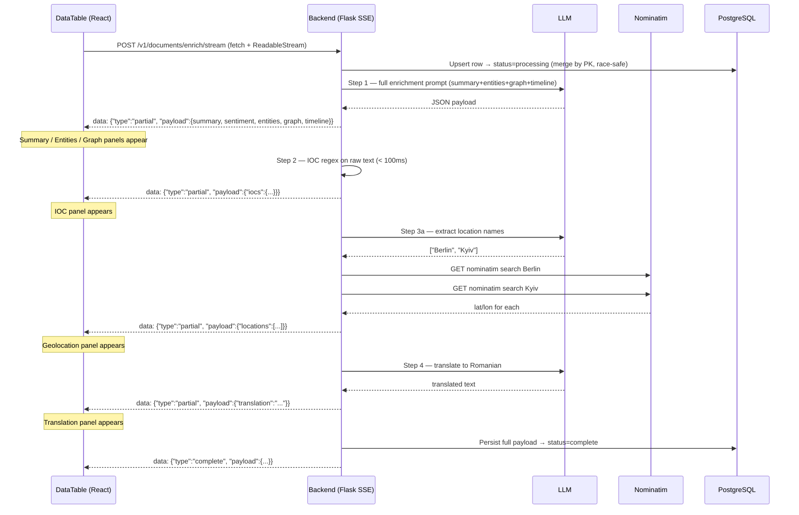

#### Caching & force-refresh

On second open, if the row is `status=complete` in PostgreSQL, the backend immediately emits a `cached` event with the full payload — no LLM calls. To force re-enrichment, click the **Re-enrich** button which sends `"force": true`.

Individual fields can also be refreshed independently:

```
POST /rag/v1/documents/enrich/field
{ "datasource": "...", "doc_id": "...", "text": "...", "field": "sentiment" }
```

Valid fields: `sentiment`, `classification`, `entities`, `summary`, `graph`, `timeline`, `locations`, `iocs`, `translation`

---

### 6. Advanced Search & Filtering

The Data Exploration tab provides a filter bar (toggled by the Filter button, with an active-filter count badge) and a full-text search box.

#### Text search

Uses Elasticsearch `query_string` with `AND` as default operator:

```
title:"election" AND sentiment:negative
CVE-2024* AND region:europe
```

#### Filter bar

| Filter | Backend mechanism | ES or PG |
|--------|------------------|----------|
| **Sentiment** | `term` filter on `sentiment.keyword` field | Elasticsearch |
| **Status** | Resolved to doc_id set from `rag_document_status` table | PostgreSQL → ES `ids` filter |
| **Labels** | Resolved to doc_id set from `rag_document_labels` (ALL labels must match) | PostgreSQL → ES `ids` filter |
| **Classification** | Case-insensitive substring on `payload->classification` in `rag_document_enrichment` | PostgreSQL → ES `ids` filter |

#### Filter intersection logic

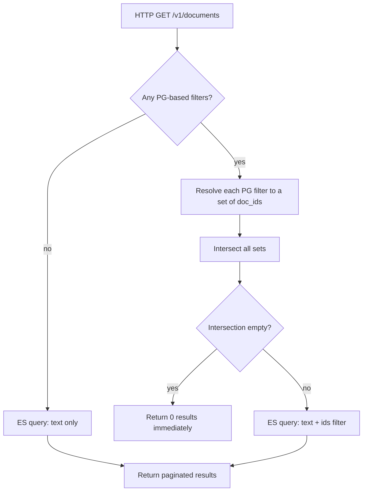

If a PG filter produces an empty set (no documents match that criterion), the endpoint short-circuits and returns zero results without querying Elasticsearch.

#### Example API call

```
GET /rag/v1/documents?datasource=qsint_docs_europe
  &q=malware
  &filter_sentiment=negative
  &filter_labels=election-2026,priority-1
  &filter_classification=Cyber Threat
  &offset=0
  &limit=50
```

---

### 7. Intelligence Report

**Route:** `/index/:idx` → **Intelligence Report** tab

Non-blocking AI-generated analysis of the entire corpus for the selected index. Generation happens in background threads; results stream to the UI via SSE as each task completes.

#### Report sections

| Section | Task type | Source | Description |
|---------|-----------|--------|-------------|
| **Corpus Statistics** | `stats` | Elasticsearch aggregations | Doc count, platform breakdown, regional breakdown, top entities, topic word cloud (up to 50 words) |
| **Hot Topics & Sentiment** | `summary` | LLM | Bubble chart + tag cloud of topics, each coloured by sentiment (Positive=green, Negative=red, Neutral=grey). Sentiments normalised: `hostile→negative`, `supportive→positive`, `mixed→negative`. |
| **Active Narratives** | `summary` | LLM | Titled narrative descriptions with supporting document IDs |
| **Trending Signals** | `summary` | LLM | Direction (↑/↓/→) + percentage change + area sparkline chart |
| **Named Entities NER** | `ner` | LLM | Bar chart + word cloud of persons, organizations, locations, tools |
| **Relationship Network** | `graph` | LLM | Interactive D3 force-directed graph — drag nodes, scroll zoom, arrow markers, colour legend by entity type |

#### Generation flow

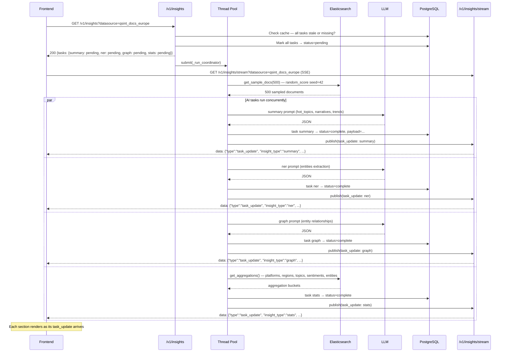

#### SSE event format

```
GET /rag/v1/insights/stream?datasource=qsint_docs_europe

data: {"type": "state", "datasource": "qsint_docs_europe", "tasks": {"summary": {...}, "ner": {...}}}
data: {"type": "task_update", "insight_type": "summary", "task": {"status": "complete", "payload": {...}}}
: heartbeat
: heartbeat
data: {"type": "task_update", "insight_type": "stats", "task": {"status": "complete", "payload": {...}}}
```

#### Caching & TTL

Insights are cached per `(datasource, insight_type)` in `rag_insights_cache`. The TTL is controlled by `INSIGHTS_CACHE_TTL` (default 1800 s = 30 min). A sample hash fingerprints the corpus — if the same sample hash is already complete, the cached result is returned instantly without re-querying the LLM.

Force-regenerate via:
```
POST /rag/v1/insights/refresh
{ "datasource": "qsint_docs_europe" }
```

Or restart a single task type:
```
POST /rag/v1/insights/task/refresh
{ "datasource": "qsint_docs_europe", "task_type": "ner" }
```

#### Send to RAG

Any section in the Intelligence Report has a **Send to RAG** button that composes a structured context message from the insight payload and pre-loads it into the RAG Chat tab for immediate follow-up questioning.

---

### 8. RAG Chat

**Route:** `/index/:idx` → **RAG Chat** tab

Conversational interface backed by Elasticsearch retrieval + LLM generation, with full streaming support.

#### How retrieval works

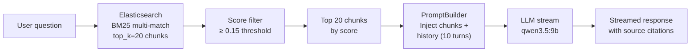

1. The query is submitted as a BM25 `multi_match` against `text^3 title^2 content^2 *`.
2. Up to `RAG_TOP_K` (default 20) chunks are retrieved.
3. Chunks below `RAG_SCORE_THRESHOLD` (default 0.15) are discarded.
4. Up to `RAG_MAX_CONTEXT_CHUNKS` (default 20) surviving chunks are injected into the prompt.
5. The last `HISTORY_TURNS` (default 10) conversation turns are included for context.
6. The LLM response streams token-by-token via SSE.

#### SSE streaming chat

```
POST /rag/v1/chat/stream
{ "datasource": "qsint_docs_europe", "query": "...", "session_id": "..." }
```

```
data: {"type": "sources",  "sources": [{"id":"abc", "score":1.42, "text":"..."}], "session_id": "..."}
data: {"type": "delta",    "content": "Based"}
data: {"type": "delta",    "content": " on"}
data: {"type": "delta",    "content": " the retrieved documents..."}
data: {"type": "done",     "message_id": "msg-uuid", "session_id": "sess-uuid"}
data: {"type": "error",    "content": "LLM timeout"}
```

The frontend renders source citations (`[doc:abc123]` → score 1.42) immediately when the `sources` event arrives, before the first token.

#### Session management

Every conversation belongs to a **Session**. Sessions are:
- Scoped to a datasource (one session per index, or shared).
- Persisted in PostgreSQL (`rag_sessions` + `rag_messages`).
- Displayed in a sidebar drawer with rename and delete actions.
- Auto-titled from the first user message if not renamed.

Sessions survive browser refresh. Switching sessions loads the full message history.

#### Pre-fill from other tabs

Other parts of the UI can inject a query into the chat:
- **Send to RAG** from Data Exploration: sends selected document content as context.
- **Ask about** from Intelligence Report: sends a generated question about a specific insight.
- **Session store** (`useSessionStore`): cross-tab query handoff via Zustand.

---

### 9. Distributed Tracing (Jaeger)

Every LLM call is instrumented with OpenTelemetry spans. Enable tracing:

```env
ENABLE_TRACING=true
QSINT_OTLP_ENDPOINT=http://localhost:4317
```

Jaeger UI: `http://localhost:16686` — service name: `qsint-rag`

#### Instrumented operations

| Span name | Attributes |
|-----------|-----------|
| `llm.complete` | `llm.model`, `llm.messages_count`, `llm.max_tokens`, `llm.response_length` |
| `llm.complete_json` | Same as above |
| `llm.stream.setup` | `llm.model`, `llm.messages_count` |

Each attribute is set as a span attribute for filtering in Jaeger. Errors set `llm.error` on the span.

The tracer singleton is acquired via `get_tracer()` (from `framework.tracing`) and lazily initialized when `ENABLE_TRACING=true`. No code changes are needed to toggle tracing.

---

## API Reference

All endpoints are prefixed with `/rag`. The base URL is `http://localhost:5100/rag`.

### Health

| Method | Path | Description |
|--------|------|-------------|
| `GET` | `/health` | Full dependency check: Postgres connectivity, ES ping, LLM ping |
| `GET` | `/liveness` | Lightweight Kubernetes liveness probe (always 200 if process is up) |

### Chat

| Method | Path | Description |
|--------|------|-------------|
| `POST` | `/v1/chat` | Synchronous RAG (blocking — full response in one JSON) |
| `POST` | `/v1/chat/stream` | SSE streaming RAG — sources event first, then token deltas |

Request body for both:
```json
{
  "datasource": "qsint_docs_europe",
  "query": "What are the main cyber threats this week?",
  "session_id": "optional-uuid",
  "top_k": 20
}
```

### Sessions

| Method | Path | Description |
|--------|------|-------------|
| `GET` | `/v1/sessions` | List sessions (`?datasource=x` to filter) |
| `POST` | `/v1/sessions` | Create session (`{datasource, title?}`) |
| `GET` | `/v1/sessions/:id` | Get session metadata |
| `PATCH` | `/v1/sessions/:id` | Rename session (`{title}`) |
| `DELETE` | `/v1/sessions/:id` | Delete session and all messages |
| `GET` | `/v1/sessions/:id/messages` | List all messages in a session |

### Datasource

| Method | Path | Description |
|--------|------|-------------|
| `GET` | `/v1/datasource/status` | Returns `{connected, doc_count, index, fields, status, has_vector}` |
| `GET` | `/v1/datasource/indices` | Returns `{indices: ["qsint_docs_europe", ...]}` |

### Documents

| Method | Path | Description |
|--------|------|-------------|
| `GET` | `/v1/documents` | Paginated document list with filters |
| `GET` | `/v1/documents/enriched` | Doc IDs that have a `complete` enrichment |
| `POST` | `/v1/documents/enrich` | Start / retrieve async enrichment (background, polling) |
| `POST` | `/v1/documents/enrich/stream` | **SSE streaming enrichment** (preferred) |
| `POST` | `/v1/documents/enrich/field` | Reload a single enrichment field |
| `GET,POST` | `/v1/documents/status` | Get or set document status (`pending`/`processing`/`done`) |
| `GET,POST` | `/v1/documents/labels` | Get or set analyst labels for documents |

#### GET `/v1/documents` parameters

| Parameter | Type | Description |
|-----------|------|-------------|
| `datasource` | string | Required — index name |
| `q` | string | Full-text search query (ES `query_string`) |
| `offset` | int | Pagination offset (default 0) |
| `limit` | int | Page size (default 50, max 1000) |
| `filter_sentiment` | string | `positive` / `negative` / `neutral` |
| `filter_status` | string | `pending` / `processing` / `done` |
| `filter_labels` | string | Comma-separated labels (AND logic) |
| `filter_classification` | string | Substring match on enrichment classification |

### Insights

| Method | Path | Description |
|--------|------|-------------|
| `GET` | `/v1/insights` | Get cached insights or trigger regeneration |
| `POST` | `/v1/insights/refresh` | Force full regeneration (`{datasource}`) |
| `DELETE` | `/v1/insights` | Wipe insights cache (`?datasource=x`) |
| `GET` | `/v1/insights/stream` | SSE stream of task status updates |
| `POST` | `/v1/insights/task/refresh` | Restart a single task (`{datasource, task_type}`) |

### Dashboard & Tasks

| Method | Path | Description |
|--------|------|-------------|
| `GET` | `/v1/dashboard/tasks` | All tasks aggregated (insights + enrichments) |
| `POST` | `/v1/dashboard/tasks/restart` | Restart a task (`{category, datasource, task}`) |
| `DELETE` | `/v1/dashboard/tasks` | Delete a task record |
| `GET` | `/v1/tasks` | Paginated task list |
| `GET` | `/v1/tasks/:task_id` | Single task detail by ID |

---

## Data Flow Diagrams

### Full Request Lifecycle — RAG Chat

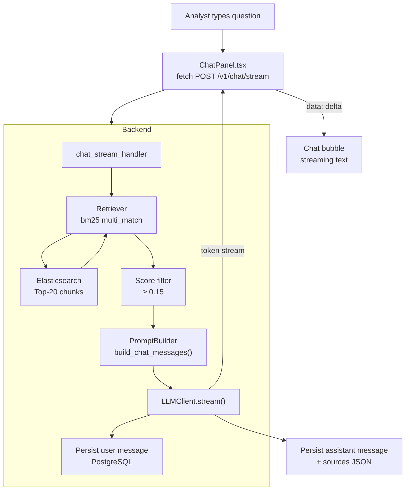

### Document Enrichment — State Machine

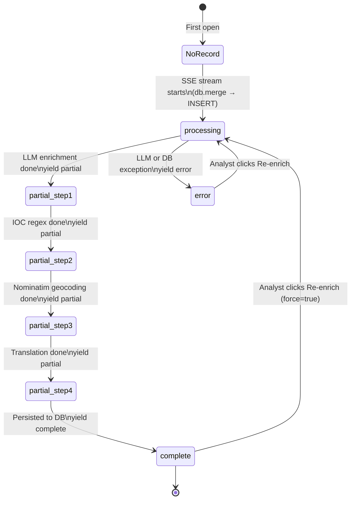

### Insights Generation — Task Lifecycle

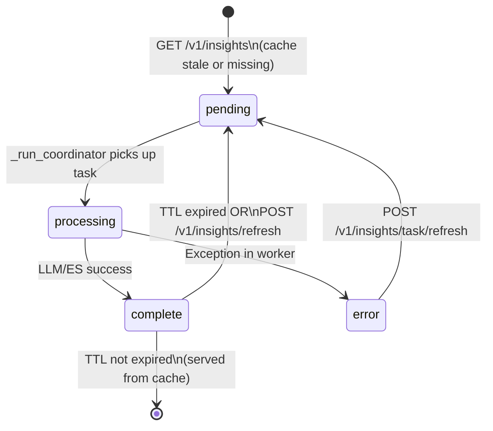

### Multi-Index Sidebar Navigation

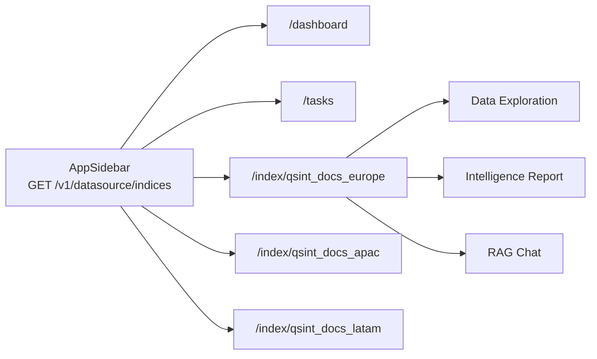

---

## Database Schema

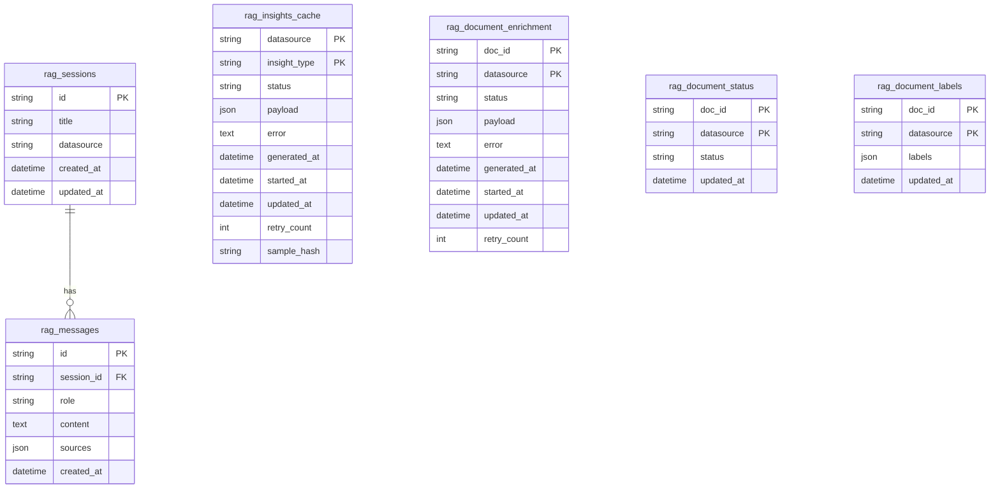

---

## Backend Components

### `src/config.py`

Single class `Config` — all environment variables with defaults. Import-time validation. The `logger.setLevel(LOG_LEVEL)` call at class body level applies immediately on first import.

### `src/rag/llm_client.py`

| Method | Description |
|--------|-------------|
| `complete(messages, system)` | Blocking call, returns full string. OTel span: `llm.complete`. |
| `complete_json(messages, system)` | Same but strips markdown fences and validates JSON. OTel span: `llm.complete_json`. |
| `stream(messages, system)` | Generator yielding token strings. OTel span covers only API call setup (`llm.stream.setup`); tokens yield outside the span. |
| `get_llm()` | Module-level singleton factory. |

### `src/rag/retriever.py`

Wraps `ESClient.search()`. Returns normalised `{id, text, score, source, metadata}` dicts. Score filtering applied here before chunks are passed to the prompt builder.

### `src/rag/prompt_builder.py`

Stateless builder with five public methods:

| Method | Used by | Output |
|--------|---------|--------|
| `build_chat_messages(query, chunks, history)` | `/v1/chat/stream` | Retrieval-augmented chat prompt |
| `build_insights_messages(sample_docs, task_type)` | InsightsEngine | Intelligence analysis prompt |
| `build_enrichment_messages(document_text)` | `enrich/stream` | Full 9-field enrichment prompt |
| `build_field_enrichment_messages(text, field)` | `enrich/field` | Single-field enrichment prompt |
| `build_translation_messages(text)` | `enrich/stream` step 4 | Translation prompt |

### `src/rag/insights_engine.py`

| Component | Description |
|-----------|-------------|
| `InsightsEngine` | Singleton. Orchestrates all insight background tasks. |
| `get_insights(datasource, force_refresh)` | Non-blocking. Marks tasks pending, submits coordinator, returns current state. |
| `_run_coordinator(datasource)` | Fetches ES sample, computes sample hash, dispatches 4 concurrent tasks to thread pool. |
| `_run_ai_task(datasource, ttype, sample, hash)` | Runs one LLM call, persists result, publishes SSE event. |
| `_run_stats_task(datasource, hash)` | Runs ES aggregations, persists result, publishes SSE event. |
| `_parse_json(raw)` | 4-strategy robust JSON extractor (direct parse → fence strip → object extraction → re-prompt). |
| `InsightsEventBus` | Thread-safe pub/sub. Subscribers are `queue.Queue` instances per datasource. |

### `src/datasource/es_client.py`

| Method | Description |
|--------|-------------|
| `test_connection()` | Ping — returns bool. |
| `list_indices(pattern)` | Returns sorted list matching `qsint_docs*`. |
| `get_index_stats(index_name)` | Doc count, field names, cluster health, has_vector flag. |
| `search(query, top_k, index_name)` | BM25 or hybrid (if dense_vector detected). |
| `get_sample_docs(n, index_name)` | Random-score sample via `function_score` with seed. |
| `get_aggregations(index_name)` | platforms, regions, topics (size 50), sentiments, entities. |
| `get_documents(index_name, offset, limit, query, id_filter, sentiment_filter)` | Paginated document fetch with composable filters. `id_filter=[]` short-circuits to 0 results. |
| `index_document(doc_id, body, index_name)` | Upsert a single document. |
| `ensure_index(index_name)` | Create index with basic mappings if not present. |

### `src/api/endpoints.py`

All HTTP handler functions. Notable internals:

- `_extract_iocs(text)` — regex-based IOC extraction, no external calls.
- `_geocode_location(name)` — Nominatim HTTP call with `User-Agent` header.
- `document_enrich_stream_handler` — Flask `Response(stream_with_context(generate()), mimetype="text/event-stream")`.
- `documents_handler` — PG filter resolution with set intersection before ES query.
- `insights_stream_handler` — SSE long-poll with `InsightsEventBus` subscription.

---

## Frontend Components

```
frontend/src/
├── RagModule.tsx                  Root — ConfigProvider, QueryClientProvider, BrowserRouter
│   ├── AppHeader                  Top bar: app name, current index, dark/light toggle
│   ├── AppSidebar                 Index list (GET /v1/datasource/indices) + nav links
│   └── Routes
│       ├── /dashboard             → DashboardPage → OverviewDashboard
│       ├── /tasks                 → TasksPageWrapper → TasksPage
│       ├── /tasks/:id             → TaskDetailPage → TaskDetailPanel
│       └── /index/:idx(/:docId)   → IndexPage (Data / Intelligence / Chat tabs)
│
├── api/
│   ├── client.ts                  Axios instance (baseURL, 60 s timeout), API_BASE export
│   ├── chat.ts                    streamChat() — fetch + ReadableStream SSE consumer
│   ├── sessions.ts                CRUD for sessions and messages
│   ├── explore.ts                 fetchDocuments, EnrichmentField type, fetchDocumentLabels, setDocumentLabels
│   ├── insights.ts                fetchInsights, openInsightsStream (SSE), refreshInsights
│   └── dashboard.ts               fetchDashboardTasks, restartTask, deleteTask
│
├── hooks/
│   ├── useChat.ts                 SSE chat with abort on unmount
│   ├── useSessions.ts             TanStack Query CRUD for sessions
│   ├── useExplore.ts              useDocuments, useEnrichDocumentStream, useDocumentLabels, useSetDocumentLabels, useReloadEnrichmentField
│   ├── useInsights.ts             SSE-backed insights with TanStack Query cache sync
│   ├── useDashboard.ts            useDashboardTasks, useRestartTask, useDeleteTask
│   └── useTasks.ts                useTask, useRestartTask, useDeleteTask
│
├── stores/
│   ├── themeStore.ts              Zustand — dark/light mode, persisted to localStorage
│   └── sessionStore.ts            Zustand — cross-tab pending query handoff
│
└── components/
    ├── chat/
    │   ├── ChatPanel.tsx           SSE chat UI — message list, input, session selector
    │   ├── MessageBubble.tsx       Renders user/assistant messages with source citations
    │   └── SessionSidebar.tsx      Session list with create/rename/delete
    ├── insights/
    │   ├── InsightsPanel.tsx       Intelligence Report — SSE task watcher, all section renderers
    │   ├── RelationshipGraph.tsx   react-force-graph-2d wrapper
    │   ├── WordCloud.tsx           react-wordcloud wrapper (maxWords=50)
    │   ├── TopicBubbleChart.tsx    Sentiment-coloured bubble chart
    │   ├── TrendAreaChart.tsx      Recharts area chart for trending signals
    │   └── EntityBarChart.tsx      Recharts horizontal bar chart for NER
    ├── explore/
    │   └── DataTable.tsx           Split-panel table, filter bar, DocumentDetailPanel, EnrichmentSection, LabelsSection
    ├── dashboard/
    │   ├── OverviewDashboard.tsx   Task tables with progress bar
    │   └── TaskDetailPanel.tsx     Task detail with latency bar and navigation buttons
    └── tasks/
        └── TasksPage.tsx           Full task list with pagination and filters
```

### Key hooks

#### `useEnrichDocumentStream`

```typescript
// Initiates SSE stream, accumulates partials, returns live state
const { payload, status, error, restream } = useEnrichDocumentStream(
  datasource,  // index name
  docId,       // document ID
  text,        // full document text
  enabled      // only streams when true (document panel is open)
)
// status: 'idle' | 'streaming' | 'complete' | 'error'
// restream(): resets state and restarts the SSE stream (force=true)
```

The hook uses `fetch` (not axios) because axios cannot consume a `ReadableStream`. An `AbortController` is wired to the effect cleanup so the SSE connection is closed when the panel is closed or the component unmounts.

#### `useDocuments`

```typescript
const { data, isLoading, isFetching } = useDocuments(datasource, {
  q: 'malware',
  offset: 0,
  limit: 50,
  sentiment: 'negative',
  status: 'done',
  labels: ['election-2026'],
  classification: 'Cyber Threat'
})
```

---

## Development Guide

### Running tests

```bash
# All unit tests
.venv/bin/python -m pytest tests/unit/ -v

# Specific module
.venv/bin/python -m pytest tests/unit/test_insights_engine.py -v

# With coverage
.venv/bin/python -m pytest tests/ --cov=src --cov-report=term-missing
```

### TypeScript type checking

```bash
cd frontend
npx tsc --noEmit
```

### Adding a new Elasticsearch index

```bash
python scripts/seed_elasticsearch.py --index qsint_docs_newregion --count 5000
```

The index appears in the sidebar immediately (next `GET /v1/datasource/indices` call). No configuration needed.

### Extending enrichment fields

1. Add a prompt constant in `src/rag/prompt_builder.py`.
2. Add the field to `build_field_enrichment_messages()` dispatch map.
3. Add the field name to `VALID_FIELDS` in `document_enrich_field_handler` in `endpoints.py`.
4. Add a step in `document_enrich_stream_handler` generate function.
5. Add a panel in `EnrichmentSection` in `DataTable.tsx`.

### Adding a new Intelligence Report section

1. Add a prompt in `prompt_builder.py` → `build_insights_messages()` dispatch map.
2. Add the task type key to `_trigger_tasks()` in `insights_engine.py`.
3. Add a new task handler case or reuse `_run_ai_task`.
4. Add rendering in `InsightsPanel.tsx` — the SSE `task_update` event with the new `insight_type` will flow automatically.

### Switching LLM provider

Any OpenAI-compatible endpoint works:

```env
# OpenAI
LLM_BASE_URL=https://api.openai.com/v1
LLM_MODEL=gpt-4o

# Anthropic (via proxy)
LLM_BASE_URL=https://your-proxy/v1
LLM_MODEL=claude-opus-4-6

# Local vLLM
LLM_BASE_URL=http://localhost:8000/v1
LLM_MODEL=meta-llama/Llama-3-8b-instruct
```

No code changes needed — only `.env` changes.

### Production deployment

The `docker-compose.yml` includes all services with health checks and restart policies. For production:

1. Set `DEV_MODE=false` and `LOG_LEVEL=INFO`.
2. Use strong passwords for `POSTGRES_USER`/`POSTGRES_PASSWORD`.
3. Enable ES security (`xpack.security.enabled=true`) and set `ES_USER`/`ES_PASSWORD`.
4. Build the frontend: `npm run build` and serve `dist/` via nginx.
5. Put an nginx reverse proxy in front of the Flask backend (gevent WSGI server).
6. Set `ENABLE_TRACING=true` and point `QSINT_OTLP_ENDPOINT` at your Jaeger/Grafana Tempo collector.
